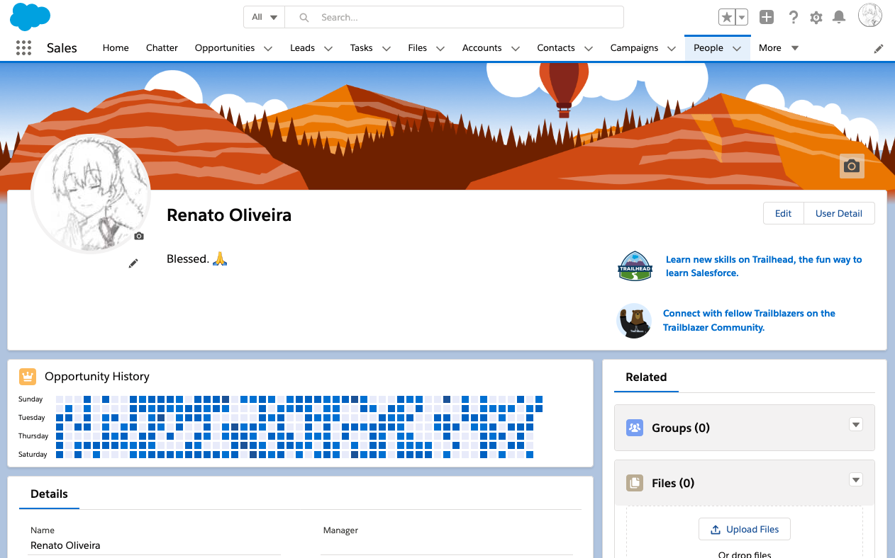
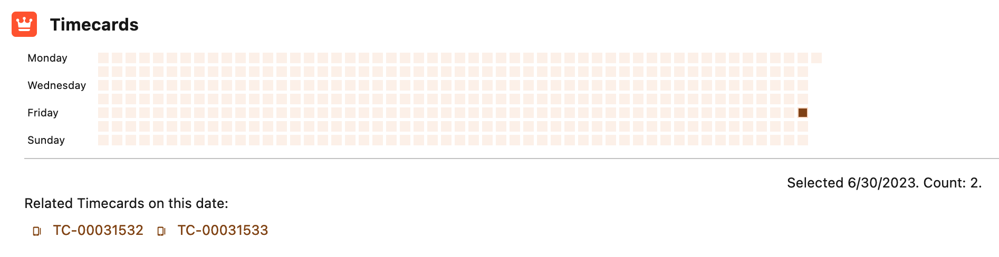
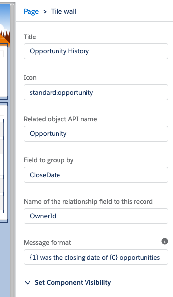

# Tilewall

A component that displays a grid like GitHub's commit history

## Base

## Showing related records

## About

So, to display a "generic" component we need to be able to iterate over basically any kind of object related to the user record, we should therefore, allow the administrator to configure that!

Information required for any relationship to the user (or any other kind of record) would be the related object's API name and what field used to group (by date). Optionally it would be nice to give the administrator the option to sum not only by record count but by the sum of another field, such as the value of a currency field (maybe in the future).

## API and App Builder setup

### API fields and description

|Field|Required|Description|
|---|---|---|
|recordId|yes|The record ID of the record where the component will show up. Automatically provided by the Lightning Experience Framework.|
|flexipageRegionWidth|no|The size of the region where the component is located. Automatically provided by the Lightning Experience Framework.|
|title|no|Title. Configurable in the App Builder.|
|iconName|no|The icon's CSS name (according to the Lightning Design System). Configurable in the App Builder.|
|relatedObjectName|yes|API name of the object related which will be groupd/counted.|
|groupByFieldName|yes|API name of the related object's field containing the date.|
|relationshipFieldName|yes|Field used as criteria for the "recordId". For example, to retrieve all opportunities of an user, this would be the `OwnerId`.|
|customWhereClause|no|A custom WHERE SOQL clause to filter records. The original query just aggregates the records, and this param, if present, adds an "AND" clause to the query (you don't need to add the "AND" prefix yourself).|
|showRecordListOnDayClick|no|When enabled, will make the component list the related records on the day that the user clicked on.|
|hideConfigErrorMessages|no|Hides the error messages when enabled. They show in red, and are useful for when you need to test this component in a sandbox environment, especially for scenarios described in the "Limitations" section below.|

## Limitations

When `showRecordListOnDayClick` is enabled, the component uses the Lightning Experience's UI API to fetch data from the related records, such as its icon and name fields. This means that this feature is unsupported for certain standard objects, such as Task and Event.

### App Builder setup

